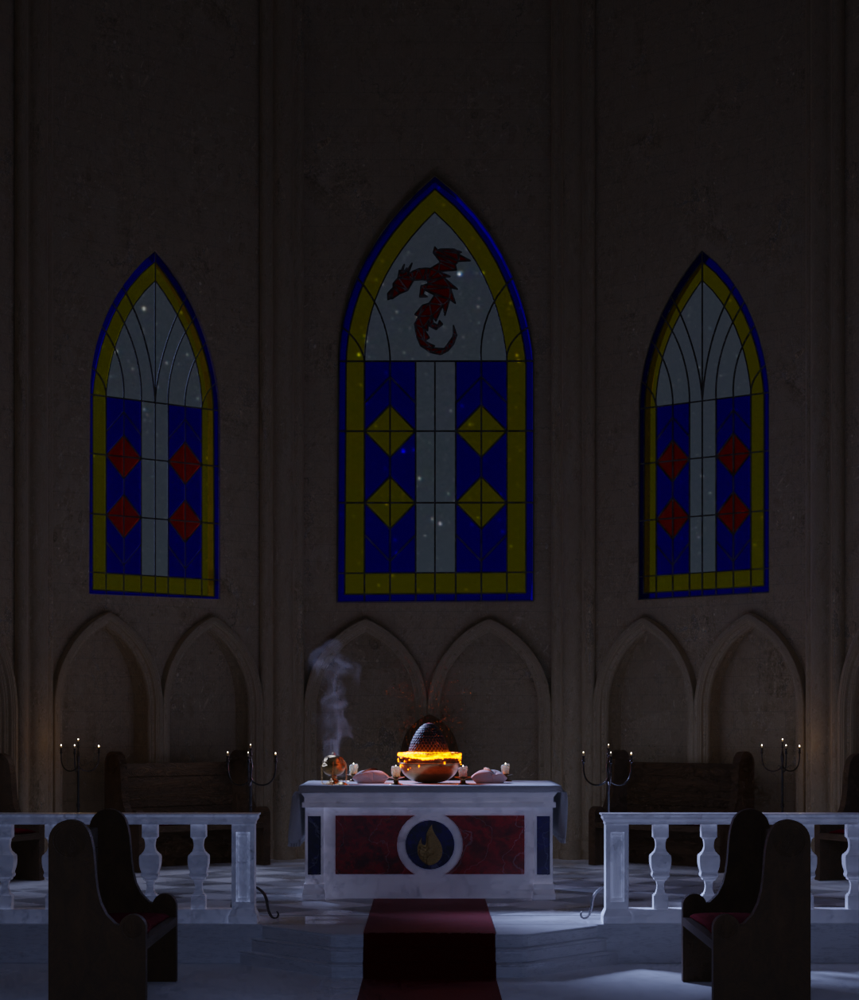
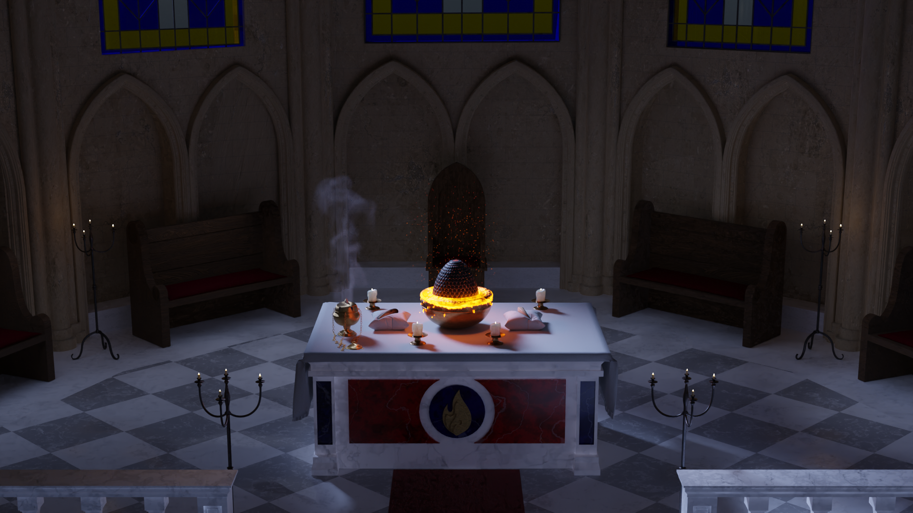

# Hi there, I'm Alberto!
Computer Engineer with a strong focus on Game Development and Real-Time Graphics Applications.
## 🎮	Game Development Projects:
- <b> Unity Projects </b>
  - **Project Mecha-Ball** - [Features Showcase (WIP)](https://youtu.be/iuCHcIRQems)
      - Isometric puzzle game featuring a small robot. Help its AI train and become the best problem-solving system.
      - Game still WIP, developed in a 6-people team as part of the "Game Design" course
  - **The Plague in Milan** – [Itch.io page](https://giulio-arecco.itch.io/the-plague-in-milan)
      - First person educational game developed as part of a team (4 people) for the “Virtual Reality” course (Dialogue and text are in Italian)

- <b> Unreal Engine 5 Projects </b>
  - **Aura: Top-Down RPG** [Aura Project - Unreal Gameplay Ability System](https://github.com/LienoPC/Aura-GameplayAbilitySystem.git)
  - **Slash: Soulslike Demo** [Slash Project - Unreal Demo](https://github.com/LienoPC/UE5-StartingCourse-SlashProject.git)

- <b> OpenGL C++ </b>
  - **Dragòn** [Dragòn - 2D Scroller Game](https://youtu.be/oxvbj1901CQ)
    - 2D Game developed as part of a 3 people team for the "Computer Graphics" course.

## 🤖 Machine Learning/AI Projects
- <b> CNN Model for automatic manga colorization </b>
  - [Manga Auto Colorization](https://github.com/LienoPC/Manga-Auto-Colorization.git)
- <b> Script prototype using YOLO system for Object and Human detection </b>
  - [Human and Object Detection for Security Systems](https://github.com/LienoPC/Human-and-Object-Detection-for-Security-Systems.git)

## 💻 Other Programming Projects
- <b> CUDA Project: N-Body Gravitational System Simulation </b>
  - [N-Body Cuda Simulation](https://github.com/LienoPC/N-BodySimulation.git)
- <b> OS161 Kernel extension: Demand Paging Memory System Implementation </b>
  - [OS161 - Demand Paging System](https://github.com/LienoPC/OS161-DemandPaging.git)
- <b> EZ-Electronics: online store web application.</b>
  - [EZ-Electronics - Software Engineering exam](https://github.com/LienoPC/EZ-Electronics)
- <b> Misfortune Game: a web application developed in React and JavaScript (frontend and backend) </b>
  - [Web-Applications - Exam](https://github.com/LienoPC/Web-Application-1-exam.git)

## Other Projects

### 🎞 "The Postman" Animation Reproduction
CGI reproduction of "The Postman" ad spot, project for the “Computer Animation” exam at Politecnico di Torino. Produced a 30-second video in 3D graphics with Blender; worked specifically on:
- Modeling, rigging and animation of the dog  
- Scene animation using modern keyframing and motion techniques
- Video sections on which I worked: 0:11-0:13; 0:18-0:23, 0:27-0:29 (fence)

[Watch the video on Google Drive](https://drive.google.com/file/d/1nNUjLfxLM2uWLDchs6Co6osewBRVnn9Z)

### 🆛 Dragòn - 3D Environment
CGI render of an original environment, part of the project for "Computer Graphics" exam at Politecnico di Torino. Experienced with classical and modern modeling techniques, including fluid simulation, sculpting, soft and rigid bodies, dynamic painting etc.

   
  
 
  

## 🤳 Connect with me [][linkedin]

[linkedin]: https://www.linkedin.com/in/alberto-cagnazzo-038202338

